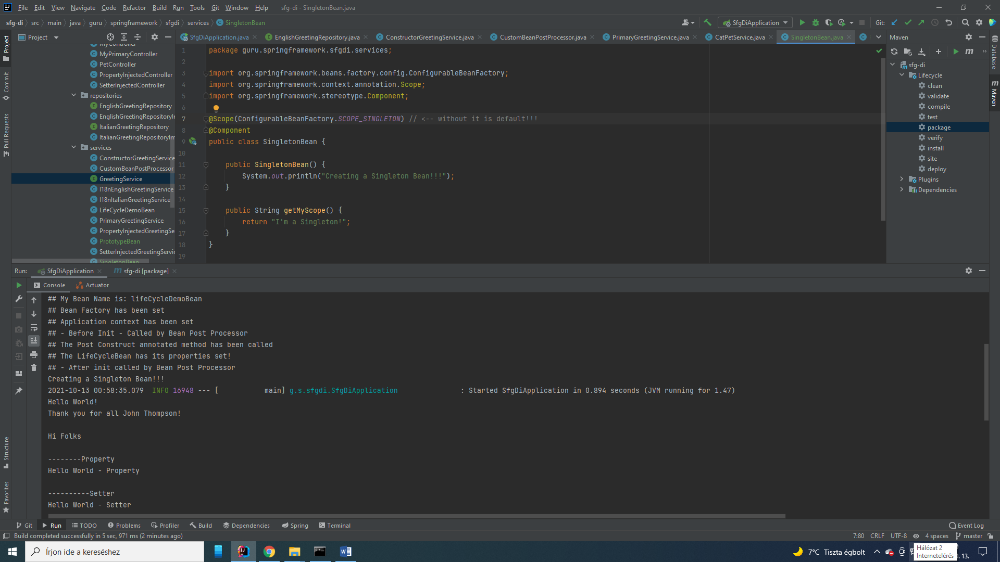
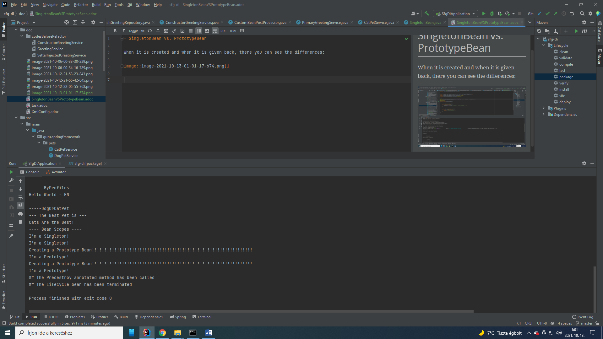

= SingletonBean vs. PrototypeBean

Spring prefers SingletonBeans, and that is the default setting (no declaration for Singleton!) ...

When it is created and when it is given back, there you can see the differences:

Scopes:

1. Singleton

2. Prototype

3. Request

4. Session

5. Global-session

6. Application Scopes

7. WebSocket

8. Custom Scope

Important: you can not override Singleton or Prototype Scopes!