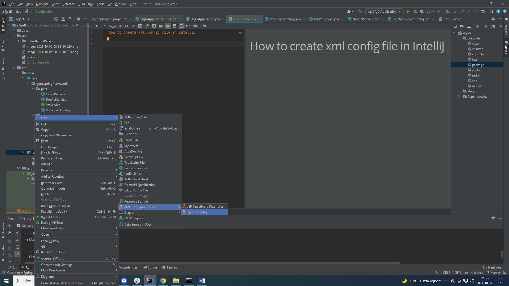
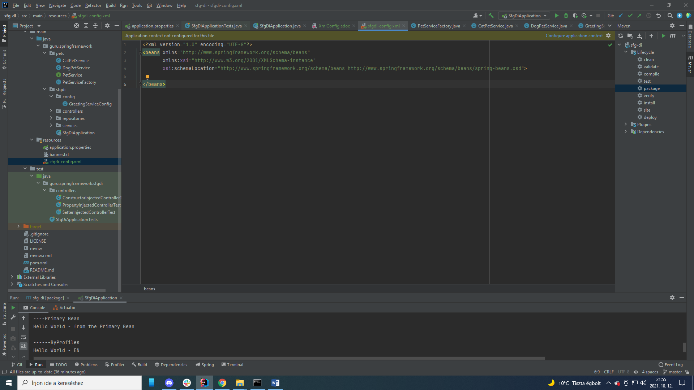
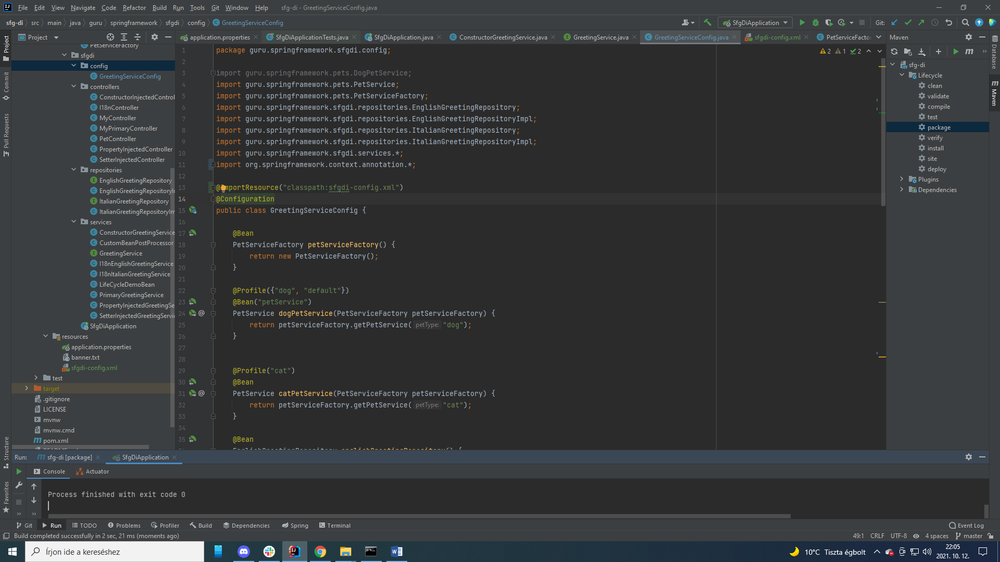

= How to create xml config file in IntelliJ

'''

Call the file as follows:

'''

sfgdi-config

@ImportResource annotation with the config.xml in the main class, or in the config class itself! ... solved also configure application context message in config.xml file!

