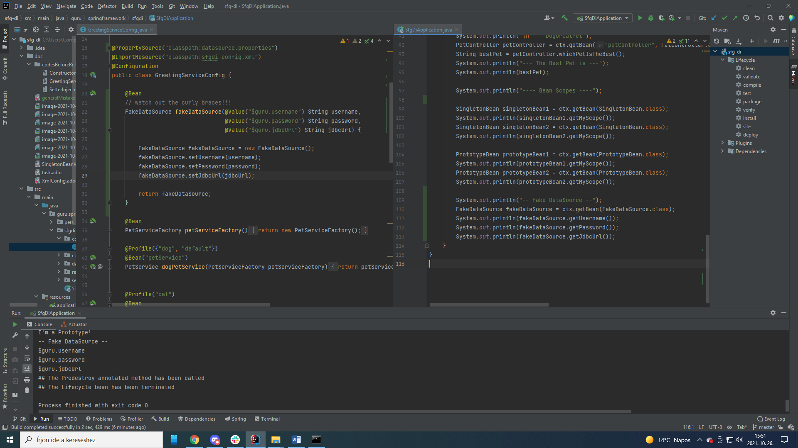

Correct code:

image::image-2021-10-26-15-52-27-289.png[]

By mistake (general mistake):

WATCH out the curly braces, and where to put them!

AND if you set username in environment as env var see result:

image::image-2021-10-26-16-25-36-281.png[]

