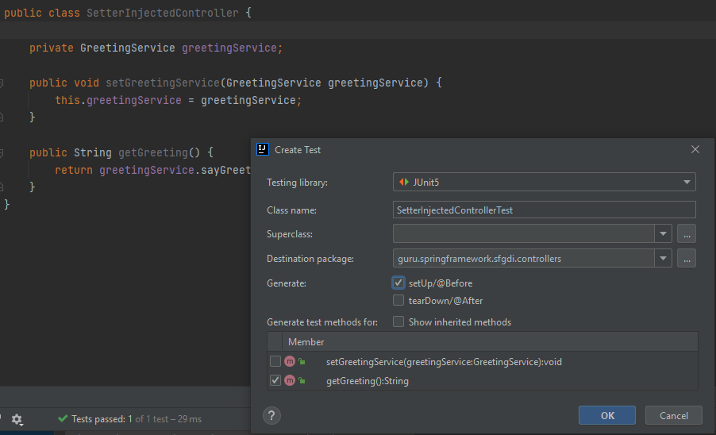
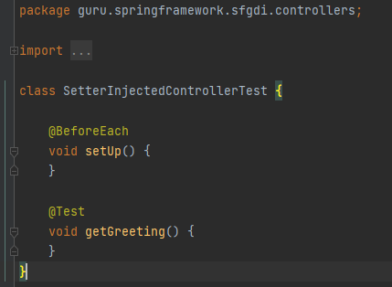

= Important regarding creating a test ...

Make a right click and choose what you need, see bellow:

the result is as follows:

How to make annotation and why? ...

PropertyInjectedController propertyInjectedController = (PropertyInjectedController) ctx.getBean("propertyInjectedController");

System.out.println(propertyInjectedController.getGreeting());

there are several problems:

1. put @Controller annotation over PropertyInjectedController Class

2. put @Autowired annotation over greetingService field in PropertyInjectedController class (still prob. there is no instance!!! so let's help SpringFramework to do it's job!)

3. put @Service annotation class GreetingServiceImpl implements GreetingService (this one generates the instance for us!)

Between @Service and @Controller and @Component there is no functional difference! tried both 3!! all works. just stereotype who uses which one ...

In case of: SetterInjectedController

we add @Controller annotation on the class, and we add @Autowired annotation to the setter!!! that says, we want a greeting service injection in this bean! (if you inject the field ... is also operates!)